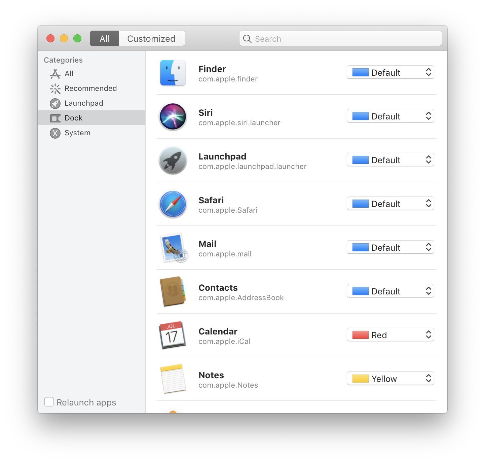
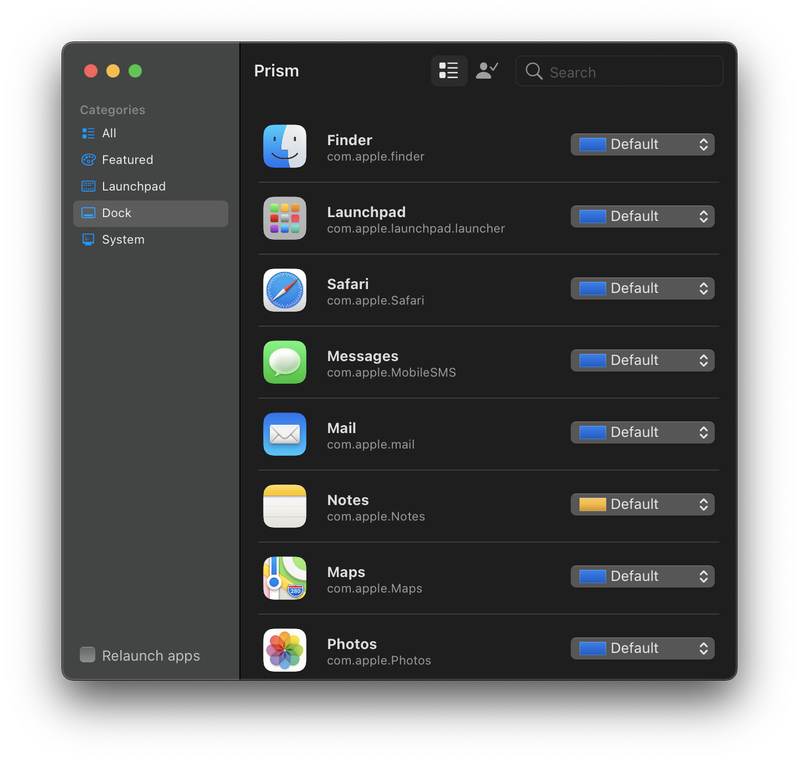

# Prism
Color matters.

Prism is a simple utility that allows you to customize macOS applications with supported system accent colors.

## How it works

Accent and selection highlight colors can be simply configured using `defaults` command by `defaults write <domain> <key> <value>`.

Officially Apple provided `UserDefaults(suiteName: String)` Cocoa API to link to a specific application defaults database, but not accessible for one in Sandbox. Therefore, inspired by [Gray](https://github.com/zenangst/Gray), the core features are still implemented by imperative processes and command line tools.

## Screenshots

</picture>
</picture>
